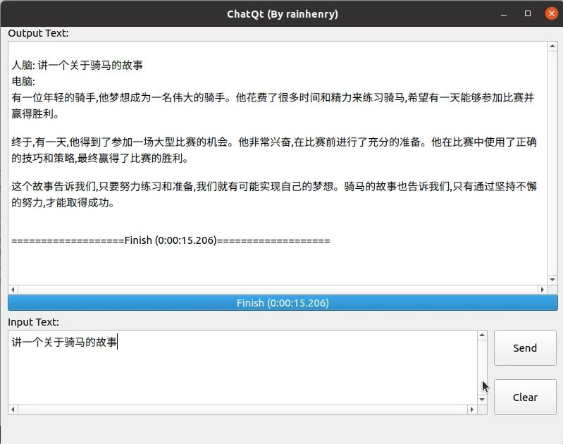
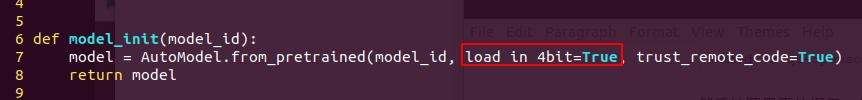
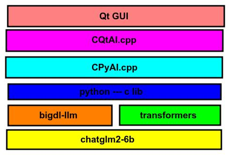

# ChatQt
## 1、运行效果



## 2、编译环境搭建

### 2.1、操作系统与硬件要求

操作系统：Ubuntu 20

硬件平台：Intel酷睿或者志强，支持AVX指令集，内存16GB以上

### 2.2、软件依赖安装

基本的软件依赖

```shell
sudo -E apt-get install gcc g++ make git vim build-essential git-lfs
```

安装python3

```shell
sudo -E apt-get install python python3 python3-pip
sudo -E pip3 install --upgrade pip
```

安装bigdl-llm依赖

```shell
sudo -E pip3 install --upgrade bigdl-llm[all]
```


### 2.3、模型下载

模型位置：https://huggingface.co/THUDM/chatglm2-6b

保存到的本地代码路径位置：./chatglm2-6b

下载命令

```shell
#!/bin/bash
git lfs install
git clone https://huggingface.co/THUDM/chatglm2-6b
```

或者

```shell
#!/bin/bash
export HF_ENDPOINT=https://hf-mirror.com
huggingface-cli download --resume-download --local-dir-use-symlinks False THUDM/chatglm2-6b --local-dir chatglm2-6b
```


### 2.4、环境验证

执行源码中的下面验证脚本即可，如果一切顺利的话，它会在终端输出Intel公司的介绍。

```shell
./chat_test.py
```


### 2.5、Qt安装和编译

我这里使用的是qt5.13.2的linux安装包，可以从下面的地址下载

https://download.qt.io/new_archive/qt/5.13/5.13.2/qt-opensource-linux-x64-5.13.2.run

下载完成后，给该文件增加可执行权限

```shell
chmod +x qt-opensource-linux-x64-5.13.2.run
```

然后按照界面的提示一步一步安装即可，详细安装过程可以参考下面的演示视频

然后编译的话只要用Qt Creator打开我们源码中的HPG.pro工程即可

## 3、使用Intel的硬件平台加速

### 3.1、支持的源码位置



如图所示，本代码默认是开启4bit量化加速的。

## 4、方案与原理

### 4.1、概述

​    本开源软件应用领域广泛，通常可以用于写作助手，为您提供思路和灵感。如上面的例子中让它写一个关于骑马的故事，它会帮你完成编写。当然也可以用于学生的辅助学习，适用于初中生以下，可以代替常规的浏览器完成知识的获取和搜索，并且可以对它发起针对性的提问。可以很好的辅助学生学习。还有就是可以用于开发工作者，让它帮您生成简单的代码片段，辅助您更好的完成程序设计工作。

​    除了应用广泛以外，本软件最大的特点是开源，并且完全本地离线运行，保证了用户的隐私和数据安全。在Intel强大硬件的加速下，可以高效快速的响应用户的需求。并且基于Qt+Python开发，可以方便移植到各种嵌入式平台中，方便制作成便携式的学习机或者早教机等。也可以集成到各种家用电器中，提高产品的人机交互体验。

​    该软件的整体思想是利用Qt制作UI界面，然后采用原生Python-C的库调用transformers和bigdl-llm的接口，从而使用本地的chatglm2-6b模型。当前您也可以根据自己的需要更换自己喜欢的自定义模型。目前市面上的其他类型软件几乎都是需要联网才能实现类似的功能。而本软件无需联网，让您的数据更加安全，让您的对话更加隐私。同时，本软件完全开源，内部所有代码尽收眼底，无需担心会有隐匿的窃取用户信息等行为。

### 4.2、使用模型

https://huggingface.co/THUDM/chatglm2-6b

### 4.3、工作流与参考源码



​    软件的结构如上图所示，最底层是chatglm2-6b的大语言模型，然后使用bigdll-llm和transformers加载并调用该模型。然后由于它们的API都是python接口，然后使用了原生的python-c库进行调用。然后将它封装成了CPyAI的类。但是该类是阻塞执行的。为了给用户带来更好的交互体验，于是在上层使用了Qt的多线程机制封装了CQtAI的类，然后最上层的人机交互界面采用Qt编写。

源码参考：

https://github.com/intel-analytics/bigdl-llm-tutorial/blob/main/ch_4_Chinese_Support/4_1_ChatGLM2-6B.ipynb

https://www.bilibili.com/read/cv27475410/

## 5、演示视频

【基于Qt的聊天机器人(本地离线版)-哔哩哔哩】 https://b23.tv/9oG793j

## 6、联系方式

邮箱：rainhenry@savelife-tech.com

## 7、许可证

本代码采用GPLv3许可证 https://www.gnu.org/licenses/gpl-3.0.en.html
